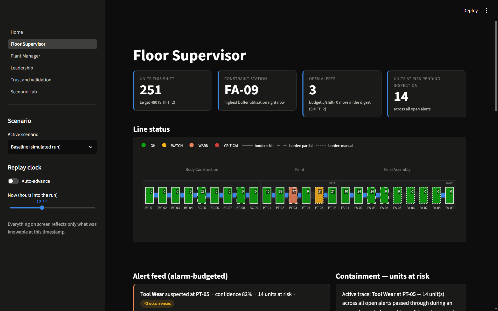

# TwinLine

A digital twin for a mixed-model vehicle assembly line: it watches a simulated 24-station line, estimates what it can't directly see, flags defects before they're built into more units, and traces them back to a likely cause.



Everything in this repo runs on simulated data. We generate the line ourselves (`src/twinline/sim/`), seed 42, so the ground truth (which unit is actually defective, and why) is known to the simulator and hidden from everything downstream of it. That's what makes the evaluation numbers below meaningful instead of self-reported: we can check our detection, prediction, and root-cause output against an answer key the modeling code never sees. It also means every number here describes how the twin performs against a plant we built to be hard in specific, deliberate ways, not against a real one. See the limitations section before you read too much into any of it.

## What this handles, and where

The scenario spec calls out five things that make this hard. Here's what we built for each and where it lives.

| Complexity | What we built | Module |
|---|---|---|
| Uneven sensor coverage (14 rich / 5 partial / 5 manual stations) | Soft sensors: estimate a blind station's reading from a same-process-family "donor" station, with a confidence score that degrades honestly with distance, support, and interval width, and abstains below a floor rather than guessing | `src/twinline/features/soft_sensors.py` |
| Delayed defect discovery (defects are only caught at inspection gates, well downstream of where they're made) | Root-cause tracing: given a caught defect, score upstream stations by whether they were anomalous when this unit passed through, then list every unit still in flight from that same window | `src/twinline/rootcause/trace.py` |
| Multi-causal root causes (tool wear, supplier batch, operator variation, ambient conditions can overlap) | Driver attribution: infer the most likely suspected driver from the evidence at the top-scoring candidate station, and back it with a matched-cohort comparison against unaffected units | `src/twinline/rootcause/attribution.py` |
| False alarms destroy trust | A hard alarm budget (5 per shift), calibrated probabilities, and abstention when the evidence is too thin to act on | `src/twinline/predict/calibration.py` |
| No writes to the live line | Every page in the app is read-only with respect to the line. Operator acknowledge/dismiss actions are logged to a ledger for audit, not sent anywhere that could change what the line does | `src/twinline/trust/ledger.py`, enforced by not having a write path at all |

## How it works, end to end

The simulator (`sim/`) generates raw sensor readings, manual check results, and unit records for a two-day run, with fault sources (tool wear, bad supplier batches, operator variation, ambient humidity) injected on a schedule. `data_access.py` reads that back in, and it's the one place in the codebase that's allowed to touch `ground_truth.csv` outside of `rootcause/` and `trust/`. Everything else is blocked from it at runtime, not just by convention (more on that in `docs/ARCHITECTURE.md`).

`features/store.py` turns raw readings into a twin state: per-station, per-time-bucket aggregates (deviation from nominal, buffer utilization, cycle time variance, manual check pass rate) and per-unit journey features. Where a station is rich, this is a direct read. Where it's partial or manual, `features/soft_sensors.py` estimates it from a donor station of the same process family and attaches a confidence score, or abstains.

`detect/` runs SPC rules (Western Electric-style) and an isolation-forest-based anomaly detector over that twin state, station by station, and emits severity-graded signals. `predict/` turns those signals plus the journey features into a calibrated per-unit defect probability, using a gradient-boosted classifier trained on a chronological split, with isotonic calibration and an uncertainty band that abstains rather than force a number. `rootcause/` takes a caught defect and traces it back through the SPC/anomaly signal history to a suspected origin station and driver. `actions/` turns that into a recommendation addressed to a named owner role. `trust/` logs every prediction to a ledger, resolves it against what actually happened, and runs the ablation backtest below.

The Streamlit app (`app/`) is a thin read layer on top of all of this. It doesn't reimplement any of the logic above; it calls into the trained pipeline and renders what comes back.

## Quickstart

```
python -m venv .venv
# Windows: .venv\Scripts\activate
# macOS/Linux: source .venv/bin/activate

pip install -e .

make demo    # generates data, trains models, runs the backtest (a few minutes)
make app     # streamlit run app/Home.py
```

`make demo` runs `generate`, `train`, and `backtest` in sequence; you can run any of those three on their own if you only need to redo one step. The app needs `data/simulated/` and `data/models/` to exist before it'll render anything. If you skip `make demo`, every page tells you so instead of failing silently.

## Results

Numbers below are from `docs/RESULTS.md`, generated by `scripts/run_backtest.py` against the seed-42 run. We're not going to restate them more favorably here than they are there.

The ablation table compares four scoring methods at the same 5-alerts-per-shift budget:

| method | PR-AUC | precision@budget | recall@budget | net benefit |
|---|---|---|---|---|
| rules-only | 0.074 | 0.000 | 0.000 | -200 |
| ML-only | 0.058 | 0.200 | 0.043 | +90 |
| hybrid | 0.071 | 0.000 | 0.000 | -200 |
| hybrid+soft-sensors | 0.071 | 0.000 | 0.000 | -200 |

This is a negative result and we're reporting it as one. Only ML-only is net-positive at this budget. Rules-only has the best raw PR-AUC of the four and the worst top-K precision, which tells you global ranking quality and top-K alarm selection are two different questions and a score can win one while losing the other. The rules layer's score used to saturate at 1.0 for every single unit (a worst-of-16-stations match with a tolerance wide enough to cover 99.8% of the run); we found that, fixed it so the score is genuinely spread out, and hybrid still lost to ML-only alone. We didn't retune the blend weight to try to manufacture a win. The rules layer stays in the product because it's the human-readable "why" behind an alert, not because it improves ranking.

By instrumentation tier, precision splits the way you'd expect from the coverage table above: manual is 88.0%, but that's inflated by a near-binary check-pass/check-fail heuristic used only to exercise the ledger, not the trained model. Partial is the tier that actually matters and it's the weakest at 3.8%. We are least reliable exactly where we are least instrumented, which is the honest version of what "uneven sensor coverage" costs you.

## Limitations

Partial-tier precision is 3.8%. That's not a rounding issue, it's the model telling you it doesn't have enough signal at those five stations to be trusted the way it can be trusted at rich ones. Don't read the "rich" or "manual" numbers as a general endorsement of the approach; read the partial number as the honest baseline.

Every evaluation number in this repo is simulator-derived. The fault sources, defect rates, and detection probabilities are ones we chose (see `docs/ASSUMPTIONS.md`), and the model is being graded against ground truth from the same generator that produced its training data's statistical structure. That's useful for checking the pipeline is internally consistent and not leaking information it shouldn't. It is not evidence this would perform the same way on a real line with real failure modes.

There's no real OT (operational technology) connectivity here. Nothing in this repo talks to a PLC, a historian, or a MES. `data_access.py` reads CSVs. Standing this up on an actual line means building that ingestion layer from scratch, and it's very likely the biggest single piece of unbuilt work in the whole project.

There's no drift monitoring. The model is trained once on the chronological split and never re-evaluated against fresh data after that. A real deployment would need to watch for calibration decay and retrain on a schedule; we don't do either.

## Repo map

```
src/twinline/
  sim/         simulator: line topology walk, fault injection, sensor generation
  features/    station/unit feature stores, soft sensors, windowing
  detect/      SPC rules and anomaly detection over the twin state
  predict/     defect-risk model, calibration/abstention, alarm budget, station hazard
  rootcause/   origin tracing, driver attribution, evidence, containment
  actions/     recommendation text and owner routing
  trust/       prediction ledger, chronological ablation backtest
  schemas/     pydantic models for every config file and cross-module record
  config.py, data_access.py

app/
  Home.py, pages/    the six Streamlit pages
  components/        chart builders and orchestration shared across pages
  state.py           cached loaders, the only place the app touches the pipeline

configs/       plant topology, simulation/model parameters, feature/detect/soft-sensor tuning
scripts/       generate_data.py, train_models.py, run_backtest.py
docs/          this file's companions: ARCHITECTURE.md, ASSUMPTIONS.md, RESULTS.md
```

## What production would need

Real OT ingestion in place of `data_access.py`'s CSV reads. Drift monitoring and a retraining schedule. A second, independently generated plant to check the soft-sensor archetypes and the ablation finding aren't artifacts of this one simulated run. Someone from the actual plant floor reviewing the recommendation text in `actions/recommender.py`, because right now it's written by people who have never run a paint booth. And a real answer on the rules-vs-ML question above, ideally from a second alarm budget and a second checkpoint, before anyone decides the rules layer should or shouldn't influence ranking in production.
